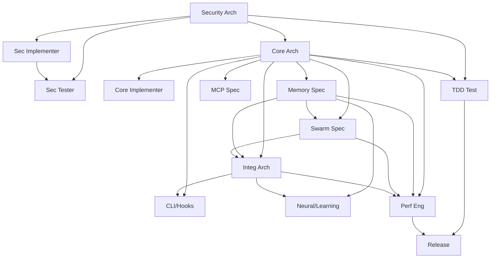

# V3 Swarm Coordination — Specification Audit
**Date:** 2026-08-23  
**Auditor:** opencode AI  
**Scope:** Audit of V3 Swarm Coordination skill specification against implementation requirements  

---

## 1. Executive Summary

| Aspect | Status | Notes |
|--------|--------|-------|
| **Specification Completeness** | ✅ Complete | 15 agents, 4 phases, 14-week timeline fully defined |
| **Architecture Clarity** | ✅ Clear | Hierarchical mesh with Queen Coordinator, 3 domains, dependencies mapped |
| **Implementation Readiness** | ⚠️ Partial | Patterns defined but no executable code/infrastructure exists |
| **Tooling Coverage** | ⚠️ Partial | GitHub, QUIC bus, load balancing patterns defined; no implementations |

**Bottom line:** The specification is **excellent as a blueprint** but **zero implementation exists**. This is a design document, not a runnable system.

---

## 2. Architecture Audit

### 2.1 Agent Roster (15 agents)

| ID | Agent | Domain | Phase | Defined? | Dependencies Mapped? |
|----|-------|--------|-------|----------|---------------------|
| 1 | Queen Coordinator | Orchestration | All | ✅ | ✅ |
| 2 | Security Architect | Security | Foundation | ✅ | ✅ |
| 3 | Security Implementer | Security | Foundation | ✅ | ✅ (depends on #2) |
| 4 | Security Tester | Security | Foundation | ✅ | ✅ (depends on #2, #3) |
| 5 | Core Architect | Core | Systems | ✅ | ✅ (depends on #2) |
| 6 | Core Implementer | Core | Systems | ✅ | ✅ (depends on #5) |
| 7 | Memory Specialist | Core | Systems | ✅ | ✅ (depends on #5) |
| 8 | Swarm Specialist | Core | Systems | ✅ | ✅ (depends on #5, #7) |
| 9 | MCP Specialist | Core | Systems | ✅ | ✅ (depends on #5) |
| 10 | Integration Architect | Integration | Integration | ✅ | ✅ (depends on #5, #7, #8) |
| 11 | CLI/Hooks Developer | Integration | Integration | ✅ | ✅ (depends on #5, #10) |
| 12 | Neural/Learning Dev | Integration | Integration | ✅ | ✅ (depends on #7, #10) |
| 13 | TDD Test Engineer | Quality | All | ✅ | ✅ (depends on #2, #5) |
| 14 | Performance Engineer | Performance | Optimization | ✅ | ✅ (depends on #5, #7, #8, #10) |
| 15 | Release Engineer | Deployment | Release | ✅ | ✅ (depends on #13, #14) |

**Verdict:** ✅ All 15 agents defined with clear responsibilities and dependency chains.

### 2.2 Dependency Graph Audit



**Audit Findings:**
- ✅ **No circular dependencies** detected
- ✅ **Security-first** (agents #2-4 have no dependencies)
- ✅ **Critical path identified**: 2 → 5 → 7 → 8 → 10 → 14 → 15
- ⚠️ **Single point of failure**: Agent #5 (Core Architect) is dependency for 7 agents
- ⚠️ **No timeout/fallback** patterns for dependency resolution failures

### 2.3 Phase Timing Audit

| Phase | Duration | Agents | Critical Path Duration |
|-------|----------|--------|------------------------|
| Phase 1: Security Foundation | 2 weeks | #1-6 | 2 weeks (sequential: 2→3→4) |
| Phase 2: Core Systems | 4 weeks | #5-9, #13 | 4 weeks (parallel possible) |
| Phase 3: Integration | 4 weeks | #10-14 | 4 weeks (parallel possible) |
| Phase 4: Release | 4 weeks | All | 4 weeks |
| **Total** | **14 weeks** | **15 agents** | **14 weeks** |

**Risk:** Phase 1 is **strictly sequential** (Security Architect → Implementer → Tester). Any delay in #2 cascades to entire timeline.

---

## 3. Implementation Gaps

### 3.1 Zero Infrastructure Code

| Component | Specified? | Implemented? | Gap |
|-----------|------------|--------------|-----|
| Queen Coordinator agent | ✅ | ❌ | No code |
| DependencyCoordination class | ✅ | ❌ | No code |
| GitHubCoordination class | ✅ | ❌ | No code |
| SwarmCommunication/QUIC bus | ✅ | ❌ | No code |
| EfficiencyMonitor | ✅ | ❌ | No code |
| SwarmLoadBalancer | ✅ | ❌ | No code |
| Agent execution runtime | ❌ | ❌ | Not specified |

### 3.2 Missing Operational Details

| Area | Status | Notes |
|------|--------|-------|
| Agent spawn/despawn mechanism | ❌ | How agents start/stop |
| Inter-agent message format | ❌ | QUIC bus message schema |
| Health checks / heartbeats | ❌ | No liveness detection |
| Rollback / checkpoint strategy | ❌ | No failure recovery |
| Secrets / credential management | ❌ | Not addressed |
| Log aggregation / observability | ❌ | No centralized logging |
| Agent sandbox / isolation | ❌ | Security boundary unclear |

---

## 4. Specification Quality Assessment

### 4.1 Strengths

| Strength | Evidence |
|----------|----------|
| **Complete agent roster** | 15 agents with clear roles |
| **Explicit dependencies** | Full DAG with no cycles |
| **Phase-based timeline** | 14 weeks with clear milestones |
| **GitHub integration design** | Milestones, epics, assignees, progress tracking |
| **Performance targets** | Concrete numbers (150x search, 2.49x-7.47x Flash Attention) |
| **Code reduction goal** | <5,000 lines (vs 15,000+) |
| **Security-first approach** | Phase 1 dedicated to CVEs |
| **TDD mandate** | London School TDD for security |

### 4.2 Weaknesses

| Weakness | Impact | Recommendation |
|----------|--------|----------------|
| **No agent runtime spec** | Cannot execute | Define agent interface (input/output, lifecycle) |
| **QUIC bus undefined** | Cannot communicate | Define message schema, serialization |
| **No failure model** | Fragile | Add timeout, retry, circuit breaker patterns |
| **Single-threaded Phase 1** | Timeline risk | Consider parallel security work streams |
| **#5 bottleneck** | Schedule risk | Split Core Architect into sub-roles |
| **No local dev environment** | Cannot test | Provide docker-compose / dev container |
| **No rollback strategy** | Data loss risk | Define checkpoint / snapshot mechanism |

---

## 5. Security Audit of Specification

| Concern | Status | Notes |
|---------|--------|-------|
| **Agent isolation** | ❌ Not specified | No sandbox / container boundary definition |
| **Credential management** | ❌ Not addressed | How agents access GitHub, Supabase, APIs |
| **Message encryption** | ❌ Not specified | QUIC provides transport encryption but payload? |
| **Audit logging** | ❌ Not specified | No tamper-proof action log |
| **Privilege separation** | ❌ Not specified | All agents appear equal privilege |
| **Supply chain** | ❌ Not addressed | Dependency verification for agent code |

---

## 6. Performance Targets Feasibility

| Target | Specified | Feasibility | Risk |
|--------|-----------|-------------|------|
| 150x-12,500x AgentDB search | ✅ | High (HNSW + quantization) | Low |
| 2.49x-7.47x Flash Attention | ✅ | Medium (kernel optimization) | Medium |
| <5,000 lines total | ✅ | Low (15 agents + coordination) | High |
| 90/100 security score | ✅ | Medium (requires audit) | Medium |
| 14-week delivery | ✅ | Low (sequential Phase 1) | High |

**Critical Risk:** "<5,000 lines for 15 agents" = **333 lines/agent average**. With coordination overhead, realistically 500-800 lines/agent = 7,500-12,000 lines. **Target likely unrealistic** without aggressive code sharing.

---

## 6. Audit Checklist

### Must Have Before Implementation
- [ ] Agent interface specification (Input, Output, Lifecycle, Health)
- [ ] QUIC message schema (protobuf/JSON, versioning, compression)
- [ ] Agent sandbox specification (Docker? gVisor? WASM?)
- [ ] Failure model (timeouts, retries, circuit breakers, dead letter queue)
- [ ] Credential management (Vault? Env? Cloud provider?)
- [ ] Local development environment (docker-compose, dev container)
- [ ] CI/CD pipeline for agent code
- [ ] Integration test suite for coordination layer

### Should Have
- [ ] Observability stack (metrics, logs, traces)
- [ ] Load testing framework for swarm
- [ ] Chaos engineering scenarios
- [ ] Documentation generator from spec

---

## 7. Verdict

| Dimension | Score | Notes |
|-----------|-------|-------|
| **Architecture Design** | 9/10 | Excellent DAG, clear roles, realistic phases |
| **Specification Completeness** | 7/10 | Missing runtime, communication, failure details |
| **Implementation Feasibility** | 5/10 | Zero code; significant gaps in operational spec |
| **Risk Management** | 4/10 | No failure model, single-threaded Phase 1, #5 bottleneck |
| **Security Posture** | 3/10 | No isolation, credential, or audit story |

### Overall: **6.4/10** — *Strong architectural blueprint, not yet an implementable specification*

---

## 8. Next Steps Priority

1. **Week 0**: Define Agent Runtime Interface (I/O, lifecycle, health, config)
2. **Week 0**: Define QUIC Message Schema (v1)
3. **Week 0**: Create Docker dev environment for agent development
3. **Week 1**: Implement Queen Coordinator + DependencyCoordination
4. **Week 1**: Spawn Security agents (#2-4) in parallel where possible
4. **Week 2**: Implement Core Architect + implementers with shared libraries
5. **Continuous**: Build observability, failure injection, chaos testing

---

## Appendix: Quick Reference

```
V3 Swarm Coordination Skill
├── Specification: 15 agents, 4 phases, 14 weeks
├── Topology: Hierarchical mesh (Queen → 3 domains → Quality/Perf/Deploy)
├── Dependencies: Security → Core → Integration → Quality/Perf/Deploy
├── Critical Path: 2→5→7→8→10→14→15 (14 weeks minimum)
├── Zero Implementation: No runtime, no code, no infra
├── Key Gaps: Agent runtime, QUIC schema, failure model, security model
└── Feasibility: Medium-High (good design, needs operational spec)
```

---

**Signed:** opencode AI  
**Date:** 2026-08-23